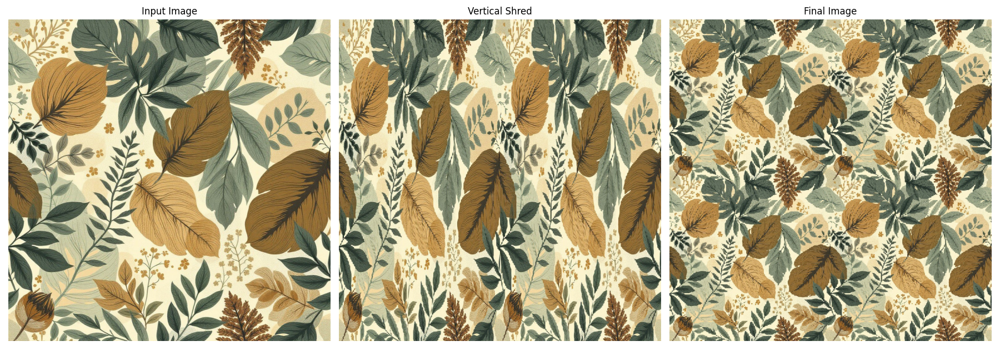
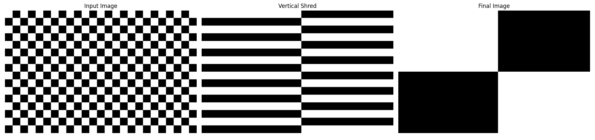

# NumPy Image Shredder

AIUA6 Practical project 2: A Python application that simulates a photo shredder effect using Numpy. It takes an image URL, divides the image into chunks, rearranges them, and displays the original, vertically shredded, and final "shredded" results.

Optionally added some extra features, numpy processing for color channels.

## Features

*   **Web-Based UI**:

    

*   **Image Input via URL**: Users can provide any direct image URL.

*   **Customizable Shredding**:
    *   Adjustable chunk width and height using sliders (this is not only for visual exploration but also to compensate input file resolution differences).
    *   Supports square or rectangular chunks, leading to varied visual effects.

*   **Image Padding**: Input images are automatically padded (using edge pixels) to ensure dimensions are perfectly divisible by the chosen chunk sizes.

*   **Two-Step Shredding Proces (as per requirement)**:
    1.  **Vertical Shredding**: Image is sliced into vertical strips, which are then reordered (even-indexed strips followed by odd-indexed strips).
    2.  **Horizontal Shredding**: The result of vertical shredding is then sliced into horizontal strips, which are similarly reordered.

*   **Color Effects**: A Numpy playground as a selection of color transformations applied to the image using NumPy array operations (can be multiple effects checked simultaneously and in a desired application order):
    *   Invert Colors
    *   Swap R/G Channels
    *   Red Channel Only
    *   Grayscale
    *   Grayscale 1 Channel
    *   Sepia
    *   Brightness Up/Down
    *   Contrast Up/Down
    *   Solarize

*   **Visual Output**: Displays three stages of the image:
    1.  Original (Padded) Image
    2.  Image After Vertical Shredding
    3.  Final Recombined (Shredded) Image

*   **Error Handling**: Handles and displays errors in the UI.

*   **Batteries included**: Comes with pre-set default values for the image URL and chunk dimensions for quick testing and playing around.

*   **More Functionality**:
    *   Quick reset inputs to their default values.
    *   Image re-processing automatically on any input change (chunk size changes update results only on release).
    *   Slicing guidelines, helping identify chunk edges.
    *   Custom output image width in pixels (subplot title fonts scaled accordingly) for exporting. Vertical padding (output image aspect ratio) is dinamically adjusted.
    *   Chunk aspect ratio locking for convenient chunk size changes.

## How It Works

### Image data structure:
A NumPy array for 2x2 pixel image would have the shape (2, 2, 3):
- **Axis 0 (Rows):** Represents the height of the image (2 pixels high).
- **Axis 1 (Columns):** Represents the width of the image (2 pixels wide).
- **Axis 2 (Channels):** Represents the color channels (3 channels: R, G, B).
```py
img_array = np.array([
  # Row 0
  [ [255,   0,   0],  # Pixel (0,0) - [R, G, B]
    [  0, 255,   0]   # Pixel (0,1) - [R, G, B]
  ],
  # Row 1
  [ [  0,   0, 255],  # Pixel (1,0) - [R, G, B]
    [128, 128, 128]   # Pixel (1,1) - [R, G, B]
  ]
])
```

### Actions:
1.  **Image Download**<br>
    The application fetches an image from the provided URL using the `requests` library. A `User-Agent` header is used to mimic a browser request.

    Initially application provides hand-picked image drop-down list. Images (with appropriate licenses) are fetched from a different sources. List items with "1️⃣" are single images and "🔄" means they are random images and can be randomized by pressing button "Reload image".
    
    Image stock platform StockCake constantly updates hashes in direct image urls so they should be checked and updated on each launch. To make it minimal, only `requests` library used with regex selector. There are some protections from automated browsing, so to simulate a user browser needed to add multiple headers which are sent usually by browsers and to unpack `response.text` added `brotli` library as `requests` does not include it.

    Scraping selectors `image_selector_regex` are included in sample image metadata and can be utilized for any source, which returns SSR HTML with an image element or APIs returning JSON. For images, where scraped URL needs parsing, instructions `url_transform_regex` and `url_transform_replacement` also could be added to metadata.

    Dog images are fully open sourced from [Stanford Dogs Dataset](http://vision.stanford.edu/aditya86/ImageNetDogs/), hosted by [https://dog.ceo/dog-api/](https://dog.ceo/dog-api/). Sources: [code](https://github.com/ElliottLandsborough/dog-ceo-api), [images](https://github.com/jigsawpieces/dog-api-images).

2.  **Image Preparation**
    *   The downloaded image is converted to a [PIL Image](https://realpython.com/image-processing-with-the-python-pillow-library/) object and then to a NumPy array.
    *   The NumPy array is padded using `np.pad` with `mode='edge'` so that its width and height are exact multiples of the user-defined `chunk_width` and `chunk_height`. As a cons, it results in _pixel stretching_ artefacts for large chunk sizes.

3.  **Shredding (`shredder.py`)**
    *   **Vertical Shredding**<br>
    The padded image is sliced into vertical chunks. These chunks are then reassembled by first taking all even-indexed chunks and then all odd-indexed chunks, stacking them horizontally.
    *   **Horizontal Shredding**<br>
    The vertically shredded image is then sliced into horizontal chunks. These are reassembled similarly (even-indexed followed by odd-indexed), stacking them vertically to produce the final image.

4.  **Color Effects Application (`utils.py -> apply_color_effect`)**<br>
    If any checkbox in color effects is selected, it's applied to the padded image array using NumPy. The order of selection is important and `solarize -> invert` is not equal to `invert -> solarize`. The image array is first converted to `np.float32` for calculations to prevent data loss or overflow, and then clipped back to the 0-255 range and converted to `np.uint8`. Though using [Pillow](https://pillow.readthedocs.io/en/stable/) to transform images (f.e grayscale, posterize, solarize etc.) would be more efficient, but this project's target is [NumPy](https://numpy.org/doc/stable/). Effects and transformations descriptions:
    *   **Invert Colors**<br>
    `255 - img_array`. NumPy performs element-wise subtraction of each pixel value from scalar 255, broadcasting to match `img` array shape. Another way is to use `~img` or `numpy.invert(img)` bitwise NOT, which would work on `uint8`, though it is less intuitively readable. Applying this to `img_copy` (which is `float32`) would be maybe slightly less performant but still correct, though `numpy.invert(img_copy)`- not.

    *   **Swap R/G Channels**<br>
    `swapped_img[..., 0], swapped_img[..., 1] = swapped_img[..., 1].copy(), swapped_img[..., 0].copy()`. NumPy's array slicing is used to select the <span style="color:red">Red</span> and <span style="color:green">Green</span> channels (0 and 1 respectively, on the last axis) and swap their contents.

    *   **Red Channel Only**<br>
    `red_only_img[..., 1:] = 0`. NumPy slicing selects the <span style="color:green">Green</span> and <span style="color:blue">Blue</span> channels (channels 1 and 2) and sets all their pixel values to 0.

    *   **Grayscale**<br>
    `gray_img = np.mean(img_copy, axis=2, keepdims=True)`. NumPy calculates the mean pixel value across the color channels (axis 2) for each pixel. `keepdims=True` maintains the third dimension, and the result is then broadcasted across three channels using `np.repeat(gray_img, 3, axis=2)`.

        **Why three identical channels** - when Matplotlib receives a single channel image array, it applies color mapping (`viridis` by default, <span style="color:blue">blue</span>-<span style="color:green">green</span>-<span style="color:goldenrod">yellow</span> gradient), so to make a grayscale image and display ir correctly, we have to keep all channels.

    *   **Grayscale 1 Channel**<br>
    1 channel version to demonstrate how Matplotlib applies `viridis` (default) [colormap](https://matplotlib.org/stable/users/explain/colors/colormaps.html).

    *   **Sepia**<br>
    Effect immitates aged photo prints, which naturally appears due to chemical changes, like silver sulfides, paper aging and others. A standard sepia transformation matrix (3x3, sepia kernel) is applied. For each pixel, the new R, G, B values are linear combinations of the original R, G, B values (e.g., `R_new = R_orig*0.393 + G_orig*0.769 + B_orig*0.189`). This is achieved through element-wise multiplication and addition on NumPy arrays representing the individual channels.

        Standard sepia transformation matrix coefficients:
        ```
        Applied to Red = (R * 0.393) + (G * 0.769) + (B * 0.189)
        Applied to Green = (R * 0.349) + (G * 0.686) + (B * 0.168)
        Applied to Blue = (R * 0.272) + (G * 0.534) + (B * 0.131)
        ```
        Changing coefficients, different sepia variations can be achieved, so in most cases software developers or camera manufacturers have their own version. [More on topic](https://leware.net/photo/blogSepia.html).

    *   **Brightness Up/Down**<br>
    `np.clip(img_copy + 30, 0, 255)` or `np.clip(img_copy - 30, 0, 255)`. A constant value is added to or subtracted from every pixel value in the NumPy array. `np.clip` ensures values remain in the valid [0, 255] range.

    *   **Contrast Up/Down**<br>
    `np.clip(128 + factor * (img_copy - 128), 0, 255)`. The formula adjusts pixel values relative to the mid-gray point (128), scaled by a `factor`. All operations are NumPy element-wise arithmetic. Factor `> 1` increases contrast, `0 < factor < 1` decreases while `0` makes the whole image at `128` gray level.

    *   **Solarize**<br>
    In photography, [solarization](https://en.wikipedia.org/wiki/Solarization_(photography)) is the effect of tone reversal observed in cases of extreme overexposure of the photographic film in the camera. Not a big fan of this, but it is ubiquitous. A higher threshold value sets a brighter threshold, and colors need to be brighter to be overexposed. `solarized_img[solarized_img >= threshold] = 255 - solarized_img[solarized_img >= threshold]`. NumPy's boolean array indexing is used to select pixels above a `threshold` and inverts their values.

5.  **Display**
    *   `Matplotlib` is used to create a figure with three subplots showing the original (padded) image, the image after vertical shredding, and the final shredded image.
    *   This figure is saved to an in-memory buffer and converted to a PIL Image, which is then displayed in the Gradio UI.
    *   Output view for seamless tile image:<br>
        
    *   Output view with color alteration - swap <span style="color:red">red</span> and <span style="color:green">green</span> channels, can reveal some hidden truth (tip: try grayscale version, it renders both dog expressions at once as all channels are combined):
        
    *   Output view with multiple effects - leaving <span style="color:red">red</span> channel only and popping brightness with contrast. This also displays transformations limited effect on an image, because only red channel is present and max brightness is just **<span style="color:red">RED</span>**, also contrast has no room to work on as it has only 256 levels of shade:
        
    *   Output view with slicing guidelines, helps visualising action results:
        
    *   Output using [thispersondoesnotexist.com](https://thispersondoesnotexist.com/)'s `StyleGAN2` face generator. This can en up as a comical lo-fi character or plain horror, use with discretion. No person's feelings has been harmed. Smack **Reload image** button to cease current person's non existence.
        
    *   Slicing [checkerboard](https://dinopixel.com/checker-board-pixel-art-9080) for a calibration target [fiducial marker](https://en.wikipedia.org/wiki/Fiducial_marker) quadrants (a wordy way to describe!):
        
    *   Slicing [circle](https://www.freepik.com/free-vector/japanese-vintage-seamless-pattern-vector-illustration-horizontally-vertically-repeatable_79635077.htm) pattern for [moire pattern](https://en.wikipedia.org/wiki/Moir%C3%A9_pattern):
        
    *   Output view with filtered-out objects:
        

## Tech Stack

*   **Python 3**
*   **Gradio**: For creating the interactive and easily customizable web UI.
*   **NumPy**: For numerical operations, primarily image manipulation as arrays (slicing, padding, stacking).
*   **Requests**: For downloading images from URLs.
*   **Matplotlib**: For generating and displaying the image outputs (original, intermediate, final).
*   **Pillow (PIL)**: For image file operations (opening, converting).

## Setup and Usage

1.  **Clone the repository (if applicable) or ensure you have all project files.**
2.  **Create and activate a virtual environment (recommended):**
    ```bash
    python3 -m venv .venv
    source .venv/bin/activate
    ```
3.  **Install dependencies:**
    ```bash
    pip install -r requirements.txt
    ```
4.  **Run the application:**
    ```bash
    python app.py
    ```
5.  Open your web browser and navigate to the URL provided by Gradio (usually `http://127.0.0.1:7860`).
6. Enter an image URL, adjust the chunk sliders, and select a color effect to see the transformations.
